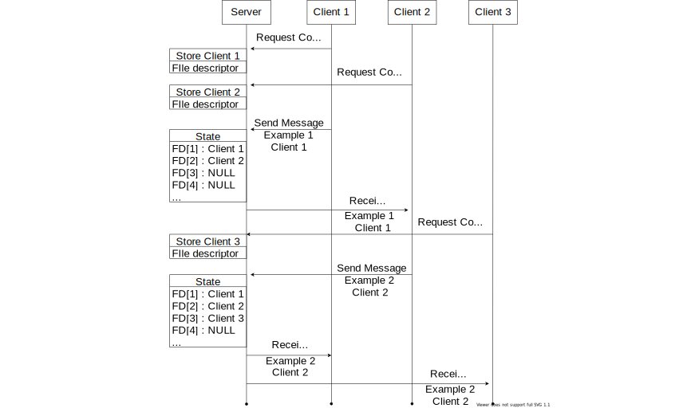

# [**TP RIO**](https://github.com/ThomasByr/chat-server)

Thomas DUMOND
Thomas BOUYER

---

# **Sommaire**

1. [**Introduction**](#Introduction)
2. 

---

# **Introduction**

Le sujet choisi est : 
- Client - Serveur centralisé multi-utilisateurs avec communication par identifiant

---
# **Principe de fonctionnement**

