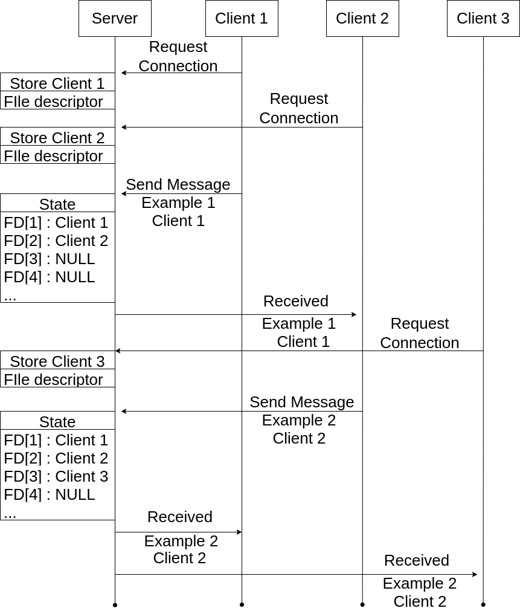

# [**TP RIO**](https://github.com/ThomasByr/chat-server)

<!-- footer: Auteurs : Thomas DUMOND & Thomas BOUYER-->

<!-- header: -->

---

# **Sommaire**

1. [**Utilisation en local**](#utilisation-en-local)
2. [**Utilisation en réseau**](#utilisation-en-réseau)
3. [**Serveur**](#serveur)
4. [**Client**](#client)
3.1 [**Utilisation en local**](#Utilisation-en-local)
3.2 [**Utilisation en réseau**](#Utilisation-en-réseau)
4. [**Explications du code**](#Explications-du-code)
4.1. [**Serveur**](#Serveur)
4.2. [**Client**](#Client)

---

# **Introduction**

Le sujet choisi est : 
- Client - Serveur centralisé multi-utilisateurs avec communication par identifiant

---
# **Principe de fonctionnement**



---
# **Utilisation**

Plusieurs choix sont possibles pour tester la bonne execution de l'application :
- Utilisation en local (on lance le serveur et les clients en local pour nos tests).
- Utilisation en réseau (le serveur est déjà lancé sur un Raspberry et les clients sont connectés au Raspberry distant).

## **Utilisation en local**
- On compile et on lance le serveur avec la commande : `make run-server`. Ainsi, le programme serveur sera compilé et lancé en local avec comme port le port **36000**. 

> On peut aussi lancer le server après compilation avec la commande : `./bin/server -p PORT` avec PORT le numéro de port d'écoute du serveur.

- On compile et on lance le client avec la commande : `make run-client`. Ainsi, le programme client sera compilé et lancé en local avec comme port le port **36000**.

> On peut aussi lancer le client après compilation avec la commande : `./bin/client -p PORT -t TARGET` avec PORT le numéro de port d'écoute du serveur et TARGET l'adresse IP du serveur distant.

---
## **Utilisation en réseau**
- Le serveur est déjà lancé sur un Raspberry et les clients seront connectés au Raspberry distant. Il suffit donc juste de lancer et de compiler les clients avec la commande : `make run-client-rpi`.

Le Raspberry distant est actuellement en train d'écouter sur le port **32000** à l'adresse 88.170.206.241. Il est donc utilisable pour tester l'application.

---
# **Explications du code**
## **Serveur**
Premièrement, on initialise le serveur sur le port d'écoute avec la fonction : 
```c
srv = init_server(targ->port);
```
Ainsi sera initialisé le descripteur de fichier du serveur et renvoyé dans la structure `srv` qui contient les informations sur le serveur.


Ensuite, on crée tous les threads qui seront utilisés pour gérer les connexions entrantes : 

```c
// launch thread to handle client requests
pthread_t tid[NB_CLIENTS];

// Init file descriptors
for (int i = 0; i < NB_CLIENTS; i++) {
    srv->fds[i] = NULL;
}

// Init sem to get id for thread
T_CHK(sem_init(&srv->sem, 0, 1));

for (int k = 0; k < NB_CLIENTS; k++) {
    T_CHK(sem_wait(&srv->sem));
    srv->id = k;
    T_CHK(
        pthread_create(&tid[k], NULL, (void *(*)(void *))run_server, srv));
}
```
Ainsi, on crée un tableau de threads qui seront utilisés pour gérer les connexions entrantes. On crée également un tableau de descripteurs de socket qui seront utilisés pour stocker les descripteurs de socket des clients. Le sémaphore `srv->sem` est utilisé pour gérer l'accès concurrent à la structure `srv`.

---
## **Client**

